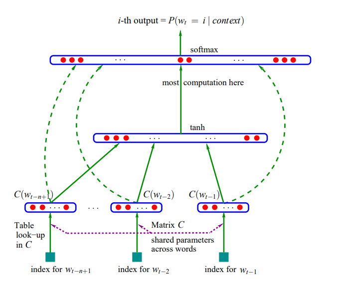

# Multilayer Perceptron Character-level Language Model

Multilayer Perceptron (MLP) based character-level language model in **PyTorch**.  
It also investigates training stability and improvements using Batch Normalization.

## Notebooks
- **mlp_char_lm.ipynb** — Implementation of a character-level language model using an MLP, with training pipeline, evaluation, and hyperparameter tuning.  
- **mlp_batch_norm.ipynb** — Analysis of activations and gradients during training, and improvements with Batch Normalization for stable training.  

## Features
- Character-level text generation  
- Training and evaluation pipeline (train/dev/test)  
- Gradient and activation diagnostics  
- Batch Normalization for improved convergence

## Architecture

*Neural architecture: f(i, w_{t−1}, … , w_{t−n+1}) = g(i, C(w_{t−1}), … , C(w_{t−n+1}))  
where g is the neural network and C(i) is the i-th word feature vector.*

## Example Result
Generated text after training:
....

## References
- He et al., "Delving Deep into Rectifiers: Surpassing Human-Level Performance on ImageNet Classification" (Kaiming Initialization) — [arXiv:1502.01852](https://arxiv.org/abs/1502.01852)  
- Ioffe & Szegedy, "Batch Normalization: Accelerating Deep Network Training by Reducing Internal Covariate Shift" — [arXiv:1502.03167](https://arxiv.org/abs/1502.03167)  
